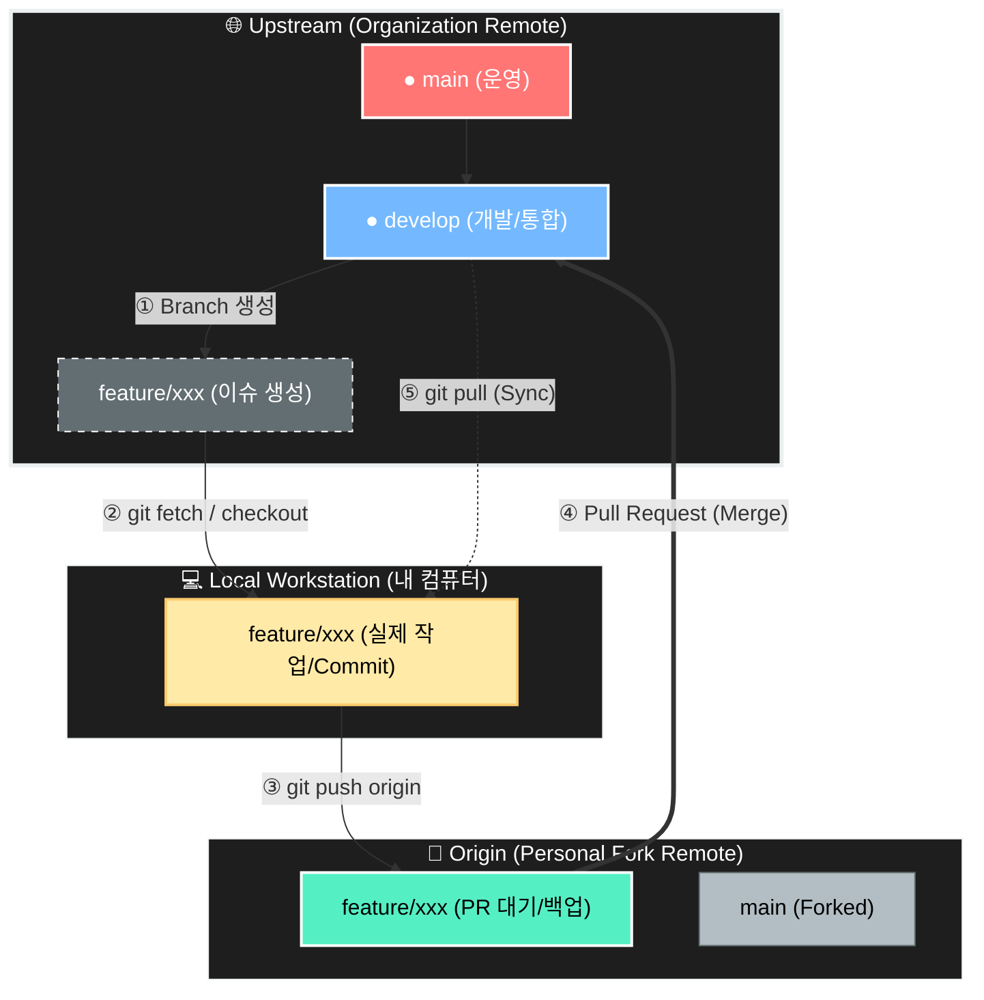

# [브랜치 전략, 커밋 컨벤션과 PR 프로세스를 적용한 오픈마켓 협업 프로젝트]

> 효율적인 GitHub 워크플로우를 기반으로 한 Vanilla JS 오픈마켓 협업 개발

---

## 0. 팀 구성 및 역할 분담

<!-- 실제 사진 삽입 -->

* 팀장
  일정 관리, 브랜치 전략 관리, 공통 구조 설계

* 팀원 A
  상품 목록 페이지 및 UI 구현

* 팀원 B
  상품 상세 페이지 및 가격·수량 로직

---

## 1. 협업 프로세스  (Collaboration Process)

> 프로젝트 목표와 협업 시스템 설계 배경

<!-- wiki_home 캡쳐 사진 추가 -->

오픈마켓 구현은 결과물이 아니라 학습을 위한 매개체라는 점에 팀 전원이 사전에 합의했다. 이 프로젝트의 최우선 목표는 기능 완성이 아니라 GitHub 기반 협업 시스템을 실제로 설계·운영·검증하는 경험을 축적하는 것이었다.

이를 위해 개발 착수 전에 GitHub Insights와 Notebook LM을 활용해 협업 실패·성공 사례와 권장 가이드라인을 수집·분석했고, 해당 자료를 바탕으로 협업에서 반드시 지켜야 할 기준과 우선순위를 정리했다. 이후 GitHub Organization과 저장소를 생성한 직후, 기능 개발을 전면 연기한 상태에서 브랜치 전략과 커밋 컨벤션을 먼저 합의·확정하는 절차를 거쳤다.

특히 협업 경험이 풍부한 강수민 팀원이 주도하여 Git Flow 구조, 브랜치 역할, 병합 규칙을 명확히 정의했고, 컨벤션뿐 아니라 GitHub 사용 가이드와 주요 명령어까지 포함한 협업 문서를 Wiki에 정리했다. 모든 규칙은 실제 사용을 전제로 작성되었으며, 캡처 이미지와 주석을 통해 팀원 간 이해 편차를 최소화하는 데 집중했다.

이러한 사전 합의와 문서화 과정을 통해, 브랜치 전략은 단순한 작업 분기 수단이 아니라 팀 전체의 개발 흐름과 책임 범위를 명확히 하는 핵심 협업 장치로 기능하도록 설계되었다.

---

## 1.1 협업 방식 및 GitHub 운영 원칙

이 프로젝트는 결과물 자체보다 **협업 과정과 개발 시스템을 학습·정착하는 것**을 핵심 목표로 한다.
이를 위해 GitHub 커뮤니티 표준을 기준으로 협업 규칙을 수립하고, 실제 팀 협업에 맞게 내부 가이드를 정리했다.

> 본 저장소의 협업 체계는 다음 세 가지 (1.1.1~3) 축으로 구성된다.

### 1.1.1 협업 기준 수립

* 모든 작업은 **투명한 의사소통**, **재현 가능한 워크플로우**, **일관된 기준**을 전제로 진행한다.
* 개인 숙련도 차이로 인한 혼선을 줄이기 위해, “잘 아는 사람 기준”이 아닌 **팀 공통 기준**을 명문화한다.
* GitHub 커뮤니티 표준(행동 강령, PR·리뷰 문화, 브랜치 보호 개념)을 내부 협업 규칙의 기반으로 삼는다.

### 1.1.2 프로젝트 협업 가이드 (핵심 기준)

실질적인 협업 기준은 **브랜치 전략, 커밋 규칙, PR 흐름**에 집중되어 있으며, 이는 팀 내부 합의를 통해 결정된다.

* Git-flow 기반 브랜치 전략
  기능 단위 개발과 안정적인 병합을 위해 main / develop / feature 구조를 사용한다.

* 커밋 규칙
  커밋 타입을 명확히 하고, 변경 의도를 한눈에 파악할 수 있도록 메시지 형식을 통일한다.

* Pull Request 프로세스
  모든 변경 사항은 PR을 통해 공유되며, 리뷰 승인 후 병합하고 작업 브랜치는 삭제한다.

### 1.1.3 보조 가이드 문서의 목적

다음 문서들은 “규칙”이 아니라 **반복 숙달과 사용 통일성**을 위한 참고 가이드다.

<!-- 병렬 사진 삽입 -->

* git 명령어 정리
  Git 사용 경험이 적은 팀원도 동일한 흐름으로 작업할 수 있도록 기본 명령어를 정리했다.

* GitHub Projects 및 Issue / PR 사용 가이드
  이슈 생성, Projects 관리, PR 생성 과정을 단계별로 정리해 작업 관리 방식을 통일했다.

이 문서들은 협업 기준을 강제하기 위한 것이 아니라,
**팀 전체의 작업 리듬을 맞추기 위한 실무 보조 자료**로 활용한다.

> Quick Reference

* Wiki
<!-- QR 삽입 -->

* 협업 기준(필수): Wiki → [프로젝트 협업 가이드 (Branch & Commit & PR)](https://github.com/open-market-project/open-market-project/wiki/%ED%94%84%EB%A1%9C%EC%A0%9D%ED%8A%B8-%ED%98%91%EC%97%85-%EA%B0%80%EC%9D%B4%EB%93%9C-(Branch-&-Commit-&-PR))
* 사용 가이드(참고): Wiki → [git 명령어 정리 / GitHub Projects 및 Issue PR사용 가이드](https://github.com/open-market-project/open-market-project/wiki/GitHub-Projects-%EB%B0%8F-Issue---PR-%EC%82%AC%EC%9A%A9-%EA%B0%80%EC%9D%B4%EB%93%9C)

<!-- ---


* main
  배포 전용 브랜치
* develop
  기능 통합 및 테스트 브랜치
* feature/기능명
  단위 기능 개발 브랜치
* hotfix/이슈명
  긴급 수정 브랜치

브랜치 생성 → 기능 개발 → PR → 코드 리뷰 → develop 병합 → 배포 시 main 병합 흐름을 유지함. -->

## 2. 실제 적용된 협업 구조 아키텍처

---

### 2.1. 브랜치 전략 (Git-flow 기반)

> 본 프로젝트는 중·대규모 협업에 적합한 Git-flow 전략을 기반으로 브랜치 구조를 운영한다.
기능 개발, 통합, 배포, 긴급 수정의 역할을 명확히 분리해 안정성과 협업 효율을 확보하는 것을 목표로 한다.

---

### 2.1.1 Branch Workflow


<figure>
  
  <figcaption align="center"><b>Fork 레포 전략을 적용한 Git 작업 흐름</b></figcaption>
</figure>

> 본 프로젝트는 코드의 안정성과 협업 효율을 위해 아래의 브랜치 워크플로우를 따릅니다. 모든 작업은 **원본 레포지토리의 `develop` 브랜치**를 기준으로 진행됩니다.

작업 순서 (Workflow Steps)

1. **기준 브랜치 최신화**: 로컬의 `develop` 브랜치를 원본 레포(`upstream`)의 최신 상태로 업데이트합니다.
2. **이슈 브랜치 생성**: 최신 `develop` 브랜치에서 분기하여 로컬 환경에 작업용 이슈 브랜치를 생성합니다.
3. **작업 및 커밋**: 로컬 이슈 브랜치에서 기능을 구현하고 커밋을 진행합니다.
4. **개인 레포 Push**: 작업 완료 후, 본인의 개인 fork 레포지토리(`origin`)로 해당 브랜치를 `push`합니다.
5. **Pull Request 생성**: 개인 fork 레포의 작업 브랜치에서 **원본 레포의 `develop` 브랜치**를 대상으로 PR을 생성합니다.

---

브랜치 운용 규칙

| 구분 | 내용 |
| --- | --- |
| **기준 브랜치** | `upstream/develop` (Single Source of Truth) |
| **작업 브랜치** | 로컬 환경의 `feature/이슈번호` 또는 `issue-브랜치명` |
| **Push 대상** | `origin` (개인 Fork 레포지토리) |
| **PR 대상** | `origin/작업-브랜치` → `upstream/develop` |

---

제시해주신 핵심적인 내용들을 바탕으로, **README.md**에 바로 복사해서 사용하실 수 있도록 깔끔하게 정리해 드립니다.

각 항목의 상세 내용은 `<details>`와 `<summary>` 태그를 활용해 토글로 구성했습니다.

---

 왜 Fork 기반 워크플로우를 사용하나요?

Fork는 단순한 복제가 아닙니다. **"실수를 방지하는 안전장치"**이자 **"고품질의 협업을 기술적으로 강제하는 구조"**입니다. 우리가 이 방식을 채택한 핵심 이유는 다음과 같습니다.

<details>
<summary>1. 실수 방지 (1차 방어선)</summary>

* **원본 레포(Upstream) 보호:** 원본에 직접적인 push 권한을 제한하여, 실수로 `main`이나 `develop` 브랜치에 코드를 올리는 것을 방지합니다.
* **히스토리 오염 차단:** 한 번 잘못 push된 코드는 히스토리 오염과 큰 롤백 비용을 초래합니다.
* **자유로운 실험:** "실수할 자유는 개인 공간(Origin)에서만 허용"됩니다. 개인 포크 레포에서는 마음껏 실험하고 검토된 코드만 원본에 반영합니다.

</details>

<details>
<summary>2. PR(Pull Request) 프로세스 강제</summary>

* **구조적 강제:** Fork 구조에서는 원본 레포로 직접 push가 불가능하므로, PR이 유일한 반영 경로가 됩니다.
* **품질 보장:** 이를 통해 코드 리뷰, 변경 이력 확인, 승인 절차 등 협업에 필요한 규칙을 기술적으로 강제하여 프로젝트의 전체적인 품질을 유지합니다.

</details>

<details>
<summary>3. 책임 범위의 명확한 분리</summary>

* **자동 기록:** PR 기반의 협업은 "누가, 어느 브랜치에서, 어떤 변경을, 어떤 기준으로" 요청했는지 자동으로 기록합니다.
* **추적 가능성:** 원본 레포에 직접 push할 때 발생할 수 있는 '검토 없는 변경'을 방지하고, 모든 코드의 변경 맥락을 추적 가능하게 만듭니다.

</details>

<details>
<summary>4. 브랜치 히스토리 품질 유지</summary>

* **맥락 중심의 관리:** feature 브랜치의 난립이나 무의미한 merge commit, 실험용 커밋들이 원본 히스토리에 섞이는 것을 방지합니다.
* **선형 히스토리:** PR 단위로 맥락이 정리되며, 필요 시 rebase를 통해 깔끔하고 가독성 좋은 커밋 히스토리를 유지할 수 있습니다.

</details>

<details>
<summary>5. 개발자의 심리적 안정감</summary>

* **심리적 효과:** "원본에 바로 반영된다"는 부담감은 줄이고, "내 공간에서 충분히 실험한다"는 자유를 제공합니다.
* **결과:** 이 안정감은 개발 과정에서의 과감한 실험과, 원본 반영 시의 신중함이라는 긍정적인 결과로 이어집니다.

</details>

---

> Git 명령어 사용 예시 (Workflow Reference)

<details>
<summary><b>1. 초기 설정 (최초 1회)</b></summary>

내 계정으로 포크(Fork)한 저장소를 로컬에 복제하고, 원본 저장소(`upstream`)를 연결합니다.

```bash
# 1. 개인 fork 레포 clone
git clone https://github.com/내계정/open-market-project.git
cd open-market-project

# 2. upstream(오가니제이션 원본) 연결
git remote add upstream https://github.com/open-market-project/open-market-project.git

# 3. 연결 확인
git remote -v

```

</details>

<details>
<summary><b>2. 기능 개발 시작 (이슈 브랜치 생성)</b></summary>

원본 저장소의 최신 상태를 가져온 뒤, 작업할 이슈 브랜치를 생성합니다.

```bash
# 1. upstream 최신 상태 동기화
git fetch upstream

# 2. 이슈 브랜치 생성 및 체크아웃
# upstream의 특정 이슈 브랜치를 추적하며 로컬에 생성합니다.
git checkout -b feature/issue-1 upstream/feature/issue-1

```

</details>

<details>
<summary><b>3. 작업 및 커밋</b></summary>

로컬에서 코드를 수정하고 커밋을 기록합니다.

```bash
# 작업 수행 후...
git add .

# 팀 컨벤션에 맞춘 커밋 메시지 작성
git commit -m "feat: 상품 상세 페이지 API 연동 작업"

```

</details>

<details>
<summary><b>4. PR 전 최신화 (Rebase)</b></summary>

내 작업 내역을 최신 `upstream/develop` 지점 위로 재배치하여 충돌을 방지합니다.

```bash
# 1. 최신 변경사항 가져오기
git fetch upstream

# 2. upstream/develop 기준으로 내 브랜치 재배치
git rebase upstream/develop

```

> **참고:** 충돌 발생 시 코드 수정 후 `git add .` -> `git rebase --continue`를 진행합니다.

</details>

<details>
<summary><b>5. Push 및 PR 생성</b></summary>

정리된 코드를 내 원격 저장소(`origin`)에 올리고 PR을 생성합니다.

```bash
# 개인 fork(origin)로 푸시
git push origin feature/issue-1

```

**GitHub PR 설정:**

* **Source:** `내계정/feature/issue-1`
* **Target:** `upstream/develop`

</details>

<details>
<summary><b> 절대 주의사항 (Don'ts)</b></summary>

* **로컬 `main`에서 `merge` 금지:** `main`은 기준점일 뿐이며 직접 병합하지 않습니다.
* **`origin/main`으로 `push` 금지:** 개인 포크의 `main`을 오염시키지 말고 `feature` 브랜치를 사용합니다.
* **PR 없이 직접 반영 시도 금지:** 모든 코드는 리뷰를 거쳐 PR로 병합되어야 합니다.

</details>

---

### 2.1.2 Branch Naming Convention

브랜치 이름은 프로젝트의 일관성을 위해 아래의 형식을 따르며, 모든 변경 사항은 **Pull Request**를 통해 병합하는 것을 원칙으로 합니다.

`<Type>/<Issue Number 또는 작업 내용>`

> **Note:** 각 브랜치는 반드시 명확한 **Parent 브랜치**에서 생성해야 하며, 작업 완료 후 해당 Parent 브랜치로 PR을 보냅니다.

### 2. 브랜치 타입 정의

| 타입 (Type) | 설명 | 예시 |
| --- | --- | --- |
| `feature` | 새로운 기능 추가 | `feature/43-login-feature` |
| `fix` | 일반적인 버그 수정 | `fix/105-navbar-bug` |
| `hotfix` | 운영 중 발생한 긴급 버그 수정 | `hotfix/checkout-error` |
| `chore` | 코드 정리, 설정 변경 등 기능과 무관한 작업 | `chore/update-eslint-rules` |
| `docs` | 문서 수정 (README 등) | `docs/update-readme` |
| `test` | 테스트 코드 추가 또는 수정 | `test/user-service-tests` |
| `refactor` | 기능 변경 없는 코드 구조 개선 | `refactor/authentication-service` |
| `ci` | CI/CD 설정 및 자동화 파이프라인 수정 | `ci/update-github-actions` |

---

본 브랜치 전략은 실제 프로젝트 운영 과정에서 적용·검증된 구조를 기준으로 하며,
모든 협업은 해당 규칙을 전제로 진행한다.


### 2.2 커밋 컨벤션 (Commit Convention)

팀 공통 커밋 규칙을 엄격히 적용함.

* feat: 새로운 기능 추가
* fix: 버그 수정
* docs: 문서 수정
* style: 코드 포맷, 세미콜론 등 스타일 수정
* refactor: 기능 변경 없는 구조 개선
* chore: 설정, 빌드, 기타 작업

형식

```
type: 요약 내용 (#이슈번호)

- 변경 사항 1
- 변경 사항 2
```

---

### 1.3 이슈 기반 작업 관리

* 모든 작업은 GitHub Issue 생성 후 진행
* Issue 단위로 feature 브랜치 생성
* 작업 범위, 완료 조건, 체크리스트를 Issue에 명시
* PR은 반드시 관련 Issue를 연결하여 생성

---

### 1.4 코드 리뷰 프로세스

* PR 생성 시 Reviewer 지정 필수
* 최소 1인 이상 승인 후 병합
* 리뷰 기준

  * 코드 가독성 및 컨벤션 준수 여부
  * 공통 컴포넌트 영향도
  * 사이드 이펙트 발생 가능성
  * 불필요한 중복 코드 여부

---

### 1.5 협업 도구 활용

* GitHub Issues: 작업 단위 관리
* GitHub Projects: 진행 상태 시각화
* GitHub Wiki: 회의록, 규칙, 참고 문서 정리
* 정기 미팅 기록: Wiki 또는 Issue로 관리

---

## 2. 프로젝트 개요

### 2.1 프로젝트 목표

* GitHub 기반 협업 프로세스 실습
* 커밋 컨벤션과 PR 중심 개발 문화 정착
* 역할 분담 기반 프론트엔드 협업 경험 축적

---

### 2.2 핵심 기능

* 상품 목록 및 상세 페이지
* 장바구니 및 수량·가격 계산
* UI 컴포넌트 분리 및 재사용 구조
* 상태 기반 인터랙션 처리

---


---

## 4. 개발 환경 및 배포

### 4.1 개발 환경

* Language: HTML, CSS, Vanilla JavaScript
* Version Control: Git, GitHub
* 협업 도구: GitHub Issues, Projects, Wiki

---

### 4.2 배포 정보

* 배포 URL:
* 테스트 계정:

---

## 5. 프로젝트 구조

```
📦 project_root
 ┣ 📂 assets
 ┃ ┣ 📂 css
 ┃ ┣ 📂 js
 ┃ ┗ 📂 images
 ┣ 📂 pages
 ┃ ┣ 📂 product
 ┃ ┣ 📂 cart
 ┃ ┗ 📂 login
 ┣ 📜 index.html
 ┗ 📜 README.md
```

---

## 6. 협업 중심 트러블슈팅

* Merge Conflict 발생 사례 및 해결 방식
* 공통 컴포넌트 수정 시 충돌 방지 전략
* PR 범위 과대 문제 개선 경험

---

## 7. 협업 회고

* Git Flow 기반 협업의 장단점
* 코드 리뷰 문화 정착 과정
* 문서화와 규칙의 중요성
* 향후 개선 방향

---

## 8. 협업 문서 링크

* 커밋 규칙: CONVENTION.md
* 협업 가이드: CONTRIBUTING.md
* 회의 기록: GitHub Wiki
* 주요 PR 링크 모음

