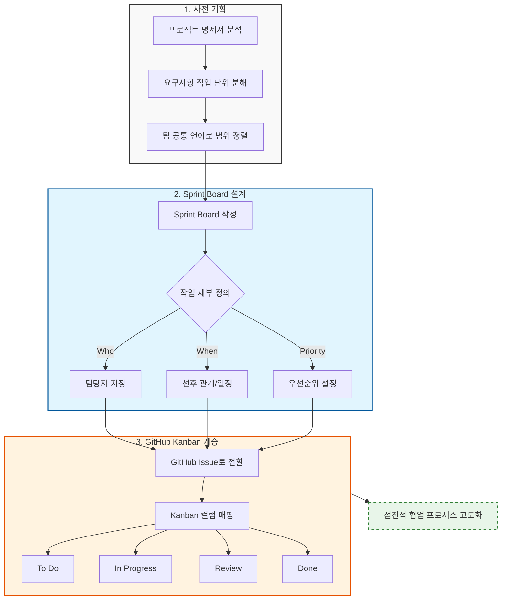
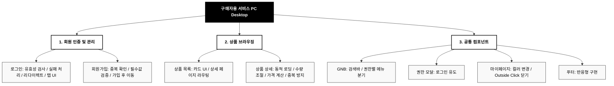
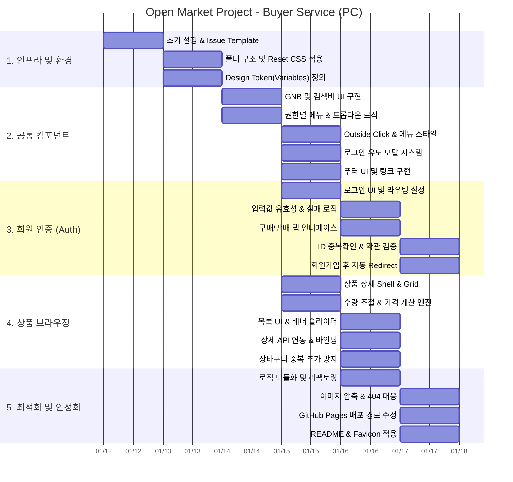

# [브랜치 전략, 커밋 컨벤션과 PR 프로세스를 적용한 오픈마켓 협업 프로젝트]

> 효율적인 GitHub 워크플로우를 기반으로 한 Vanilla JS 오픈마켓 협업 개발

---

## 0. 팀 구성 및 역할 분담

## 👥 팀원 소개 및 역할

| 프로필 | 이름  | 담당 영역 | 핵심 책임 | 주요 개발 산출물 |
| :---: | :--- | :--- | :--- | :--- |
|  |**이&nbsp;현&nbsp;규** | Core Logic | 팀장,상품 단위 핵심 비즈니스 로직 구현 | 상품 상세 UI, API 데이터 바인딩, 실시간 가격/수량 계산 로직, README 작성 |
|  | **조&nbsp;서&nbsp;연** | Foundation | 인증 시스템 총괄 및 프로젝트 베이스라인 구축 | 초기 구조 설계, CSS 변수/리셋, 배포 환경 구축, auth.js 기반 인증 로직 및 UI |
|  | **강&nbsp;수&nbsp;민** | UX & QA / Layout | 전역 레이아웃 및 인터랙션 일관성 확보 | GNB(검색)·Footer, 상품 목록 UI, 마이페이지, 전사 QA 및 시연 자료 제작 |

> **Note:** 기존 팀원 B의 중도 하차로 인해, 해당 담당 역할(Layout 및 메인 화면 등)은 팀원 강수민 님이 전담하여 완수하였습니다.

---
## 협업 및 프로젝트 관리 (Collaboration & Process)


> 본 프로젝트는 단순한 기능 구현을 넘어, 팀의 협업 시스템을 단계적으로 설계하고 검증하는 과정에 중점을 두었습니다. 프로세스 고도화를 통해 효율적인 개발 환경을 구축했습니다.

1. 사전 기획 및 요구사항 분해
목적: 기술 구현 전, 프로젝트 명세서를 기반으로 요구사항을 작업 단위(Task)로 분해하고 팀 공통의 개발 범위를 정렬

핵심: 단순 논의에 그치지 않고 전체 개발 범위를 팀의 공통 언어로 정의하여 작업의 모호성 제거

2. Sprint Board를 통한 구조적 설계
설계 문서화: 초기 Sprint Board를 단순 일정 관리 도구가 아닌, 프로젝트 전반의 구조를 공유하기 위한 설계 문서로 활용

다차원적 정의: 각 작업 단위별로 담당자, 선행 작업, 우선순위, 진행 상태를 정의하여 "무엇을, 언제까지, 누가, 왜 해야 하는가"에 대한 명확한 기준 수립

3. GitHub 협업 프로세스로의 점진적 계승
GitHub 기반의 협업 도구(Issue, Branch Strategy, PR)를 도입하며 기존에 합의된 작업 구조를 유기적으로 연결했습니다.

Task → Issue 전환: Sprint Board에서 정의된 작업 단위를 GitHub Issue로 생성하여 추적성 강화

상태 매핑: 기존 진행 상태를 Kanban Board의 컬럼(To Do / In Progress / Review / Done)으로 자연스럽게 매핑

연속성 유지: 새로운 도구 도입 시 계획을 재수립하는 대신, 기존의 작업 분해 방식과 책임 범위를 그대로 계승하여 도구 변경에 따른 혼선 방지 및 협업 방식의 고도화 실현

4. 프로세스의 의의
도구의 기능에 의존하기보다 팀의 합의된 워크플로우를 먼저 설계하고, 이를 도구에 맞게 발전시켜 나가는 과정을 통해 협업의 효율성을 극대화했습니다. 이는 프로젝트 관리 역량을 단계적으로 검증하고 팀워크를 견고히 하는 기반이 되었습니다.


## 1. 협업 프로세스  (Collaboration Process)

> 협업 시스템 설계 배경

<p align="center">
  
  <br>
  <em><b> 협업 시스템 설계 및 커뮤니티 가이드라인 구조 </b></em>
</p>

오픈마켓 구현은 결과물이 아니라 학습을 위한 매개체라는 점에 팀 전원이 사전에 합의했다. 이 프로젝트의 최우선 목표는 기능 완성이 아니라 GitHub 기반 협업 시스템을 실제로 설계·운영·검증하는 경험을 축적하는 것이었다.

이를 위해 개발 착수 전에 GitHub Insights와 Notebook LM을 활용해 협업 실패·성공 사례와 권장 가이드라인을 수집·분석했고, 해당 자료를 바탕으로 협업에서 반드시 지켜야 할 기준과 우선순위를 정리했다. 이후 GitHub Organization과 저장소를 생성한 직후, 기능 개발을 전면 연기한 상태에서 브랜치 전략과 커밋 컨벤션을 먼저 합의·확정하는 절차를 거쳤다.

특히 협업 경험이 풍부한 강수민 팀원이 주도하여 Git Flow 구조, 브랜치 역할, 병합 규칙을 명확히 정의했고, 컨벤션뿐 아니라 GitHub 사용 가이드와 주요 명령어까지 포함한 협업 문서를 Wiki에 정리했다. 모든 규칙은 실제 사용을 전제로 작성되었으며, 캡처 이미지와 주석을 통해 팀원 간 이해 편차를 최소화하는 데 집중했다.

이러한 사전 합의와 문서화 과정을 통해, 브랜치 전략은 단순한 작업 분기 수단이 아니라 팀 전체의 개발 흐름과 책임 범위를 명확히 하는 핵심 협업 장치로 기능하도록 설계되었다.

---

## 1.1 협업 방식 및 GitHub 운영 원칙

이 프로젝트는 결과물 자체보다 **협업 과정과 개발 시스템을 학습·정착하는 것**을 핵심 목표로 한다.
이를 위해 GitHub 커뮤니티 표준을 기준으로 협업 규칙을 수립하고, 실제 팀 협업에 맞게 내부 가이드를 정리했다.

> 본 저장소의 협업 체계는 다음 세 가지 (1.1.1~3) 축으로 구성된다.

### 1.1.1 협업 기준 수립

* 모든 작업은 **투명한 의사소통**, **재현 가능한 워크플로우**, **일관된 기준**을 전제로 진행한다.
* 개인 숙련도 차이로 인한 혼선을 줄이기 위해, “잘 아는 사람 기준”이 아닌 **팀 공통 기준**을 명문화한다.
* GitHub 커뮤니티 표준(행동 강령, PR·리뷰 문화, 브랜치 보호 개념)을 내부 협업 규칙의 기반으로 삼는다.

### 1.1.2 프로젝트 협업 가이드 (핵심 기준)

실질적인 협업 기준은 **브랜치 전략, 커밋 규칙, PR 흐름**에 집중되어 있으며, 이는 팀 내부 합의를 통해 결정된다.

* Git-flow 기반 브랜치 전략
  기능 단위 개발과 안정적인 병합을 위해 main / develop / feature 구조를 사용한다.

* 커밋 규칙
  커밋 타입을 명확히 하고, 변경 의도를 한눈에 파악할 수 있도록 메시지 형식을 통일한다.

* Pull Request 프로세스
  모든 변경 사항은 PR을 통해 공유되며, 리뷰 승인 후 병합하고 작업 브랜치는 삭제한다.

### 1.1.3 보조 가이드 문서의 목적

> 다음 문서들은 “규칙”이 아니라 **반복 숙달과 사용 통일성**을 위한 참고 가이드다.

<figure>
  <figcaption align="center">
    <b>다음 문서들은 “규칙”이 아니라 반복 숙달과 사용 통일성을 위한 참고 가이드다.</b>
  </figcaption>

  <div align="center" style="display: flex; justify-content: center; gap: 10px; margin-top: 10px;">
    
    
  </div>
</figure>

<br>

* **git 명령어 정리**
  Git 사용 경험이 적은 팀원도 동일한 흐름으로 작업할 수 있도록 기본 명령어를 정리했다.

* **GitHub Projects 및 Issue / PR 사용 가이드**
  이슈 생성, Projects 관리, PR 생성 과정을 단계별로 정리해 작업 관리 방식을 통일했다.

> Quick Reference

* Wiki
<div align="center" style="margin: 30px 0;">
  <div style="display: inline-block; padding: 25px; border: 1px solid #e1e4e8; border-radius: 12px; background-color: #ffffff; box-shadow: 0 3px 8px rgba(0,0,0,0.08);">
    
    <p style="margin-top: 20px; margin-bottom: 5px; font-size: 16px; font-weight: 600; color: #24292e;">
      위키 페이지로 바로 접속하기
    </p>
    <p style="margin: 0; font-size: 13px; color: #586069;">
      스마트폰 카메라로 위 QR 코드를 스캔해주세요.
    </p>
  </div>
</div>

* 협업 기준(필수): Wiki → [프로젝트 협업 가이드 (Branch & Commit & PR)](https://github.com/open-market-project/open-market-project/wiki/%ED%94%84%EB%A1%9C%EC%A0%9D%ED%8A%B8-%ED%98%91%EC%97%85-%EA%B0%80%EC%9D%B4%EB%93%9C-(Branch-&-Commit-&-PR))
* 사용 가이드(참고): Wiki → [git 명령어 정리 / GitHub Projects 및 Issue PR사용 가이드](https://github.com/open-market-project/open-market-project/wiki/GitHub-Projects-%EB%B0%8F-Issue---PR-%EC%82%AC%EC%9A%A9-%EA%B0%80%EC%9D%B4%EB%93%9C)


## 2. 실제 적용된 협업 구조 아키텍처

---

### 2.1. Repository Architecture


> 이 Repository Architecture는 원본 레포지토리의 안정성을 최우선으로 유지하면서, 개인 단위의 자유로운 개발과 팀 단위의 통제된 통합을 동시에 달성하기 위한 협업 구조를 전제로 설계되었다.

<details> <summary><b> Upstream (Organization Remote)</b></summary> <div markdown="1">

- 팀의 단일 기준 저장소 (Single Source of Truth).

- 실제 서비스 운영(main)과 개발 통합(develop)이 이루어지는 공간이다.

</div> </details>

<details> <summary><b> Local Workstation</b></summary> <div markdown="1">

- 유일한 실제 작업 공간이다.

- 코드 수정, 커밋, 실험은 모두 로컬의 이슈 브랜치에서 수행되며, 이 과정에서 원본 레포지토리는 직접 변경되지 않는다.

</div> </details>

<details> <summary><b> Origin (Personal Fork Remote)</b></summary> <div markdown="1">

- 개인 작업 결과의 중간 저장소이자 Pull Request의 출발점이다.

- 로컬에서 완료된 작업 브랜치는 개인 Fork에만 push되며, 원본 레포지토리로의 반영은 반드시 Pull Request를 통해서만 이루어진다.

</div> </details>

---

### 2.1.1 Branch Workflow

> 본 프로젝트는 코드의 안정성과 협업 효율을 위해 아래의 브랜치 워크플로우를 따릅니다. 모든 작업은 **원본 레포지토리의 `develop` 브랜치**를 기준으로 진행됩니다.

<figure>
  
  <figcaption align="center"><b>Fork 레포 전략을 적용한 Git 작업 흐름</b></figcaption>
</figure>

| 구분 | 내용 |
| --- | --- |
| **기준 브랜치** | `upstream/develop` (Single Source of Truth) |
| **작업 브랜치** | 로컬 환경의 `feature/이슈번호` 또는 `issue-브랜치명` |
| **Push 대상** | `origin` (개인 Fork 레포지토리) |
| **PR 대상** | `origin/작업-브랜치` → `upstream/develop` |

작업 순서 (Workflow Steps)


1. **이슈 브랜치 생성**: 최신 `develop` 브랜치에서 분기하여 로컬 환경에 작업용 이슈 브랜치를 생성합니다.
2. **기준 브랜치 최신화**: 로컬 작업 디렉토리를 원본 레포(`upstream`)의 develop 기준 최신 상태로 업데이트합니다.
3. **작업 및 커밋**: 로컬 이슈 브랜치에서 기능을 구현하고 커밋을 진행합니다.
4. **개인 레포 Push**: 작업 완료 후, 본인의 개인 fork 레포지토리(`origin`)로 해당 브랜치를 `push`합니다.
5. **Pull Request 생성**: 개인 fork 레포의 작업 브랜치에서 **원본 레포의 `develop` 브랜치**를 대상으로 PR을 생성합니다.

---

 > 왜 Fork 기반 워크플로우를 사용하나요?

Fork는 단순한 복제가 아닙니다. **"실수를 방지하는 안전장치"**이자 **"고품질의 협업을 기술적으로 강제하는 구조"**입니다. 우리가 이 방식을 채택한 핵심 이유는 다음과 같습니다.

<details>
<summary>1. 실수 방지 (1차 방어선)</summary>

* **원본 레포(Upstream) 보호:** 원본에 직접적인 push 권한을 제한하여, 실수로 `main`이나 `develop` 브랜치에 코드를 올리는 것을 방지합니다.
* **히스토리 오염 차단:** 한 번 잘못 push된 코드는 히스토리 오염과 큰 롤백 비용을 초래합니다.
* **자유로운 실험:** "실수할 자유는 개인 공간(Origin)에서만 허용"됩니다. 개인 포크 레포에서는 마음껏 실험하고 검토된 코드만 원본에 반영합니다.

</details>

<details>
<summary>2. PR(Pull Request) 프로세스 강제</summary>

* **구조적 강제:** Fork 구조에서는 원본 레포로 직접 push가 불가능하므로, PR이 유일한 반영 경로가 됩니다.
* **품질 보장:** 이를 통해 코드 리뷰, 변경 이력 확인, 승인 절차 등 협업에 필요한 규칙을 기술적으로 강제하여 프로젝트의 전체적인 품질을 유지합니다.

</details>

<details>
<summary>3. 책임 범위의 명확한 분리</summary>

* **자동 기록:** PR 기반의 협업은 "누가, 어느 브랜치에서, 어떤 변경을, 어떤 기준으로" 요청했는지 자동으로 기록합니다.
* **추적 가능성:** 원본 레포에 직접 push할 때 발생할 수 있는 '검토 없는 변경'을 방지하고, 모든 코드의 변경 맥락을 추적 가능하게 만듭니다.

</details>

<details>
<summary>4. 브랜치 히스토리 품질 유지</summary>

* **맥락 중심의 관리:** feature 브랜치의 난립이나 무의미한 merge commit, 실험용 커밋들이 원본 히스토리에 섞이는 것을 방지합니다.
* **선형 히스토리:** PR 단위로 맥락이 정리되며, 필요 시 rebase를 통해 깔끔하고 가독성 좋은 커밋 히스토리를 유지할 수 있습니다.

</details>

<details>
<summary>5. 개발자의 심리적 안정감</summary>

* **심리적 효과:** "원본에 바로 반영된다"는 부담감은 줄이고, "내 공간에서 충분히 실험한다"는 자유를 제공합니다.
* **결과:** 이 안정감은 개발 과정에서의 과감한 실험과, 원본 반영 시의 신중함이라는 긍정적인 결과로 이어집니다.

</details>

---

> Git 명령어 사용 예시 (Workflow Reference)

<details>
<summary><b>1. 초기 설정 (최초 1회)</b></summary>

내 계정으로 포크(Fork)한 저장소를 로컬에 복제하고, 원본 저장소(`upstream`)를 연결합니다.

```bash
# 1. 개인 fork 레포 clone
git clone https://github.com/내계정/open-market-project.git
cd open-market-project

# 2. upstream(오가니제이션 원본) 연결
git remote add upstream https://github.com/open-market-project/open-market-project.git

# 3. 연결 확인
git remote -v

```

</details>

<details>
<summary><b>2. 기능 개발 시작 (이슈 브랜치 생성)</b></summary>

원본 저장소의 최신 상태를 가져온 뒤, 작업할 이슈 브랜치를 생성합니다.

```bash
# 1. upstream 최신 상태 동기화
git fetch upstream

# 2. 이슈 브랜치 생성 및 체크아웃
# upstream의 특정 이슈 브랜치를 추적하며 로컬에 생성합니다.
git checkout -b feature/issue-1 upstream/feature/issue-1

```

</details>

<details>
<summary><b>3. 작업 및 커밋</b></summary>

로컬에서 코드를 수정하고 커밋을 기록합니다.

```bash
# 작업 수행 후...
git add .

# 팀 컨벤션에 맞춘 커밋 메시지 작성
git commit -m "feat: 상품 상세 페이지 API 연동 작업"

```

</details>

<details>
<summary><b>4. PR 전 최신화 (Rebase)</b></summary>

내 작업 내역을 최신 `upstream/develop` 지점 위로 재배치하여 충돌을 방지합니다.

```bash
# 1. 최신 변경사항 가져오기
git fetch upstream

# 2. upstream/develop 기준으로 내 브랜치 재배치
git rebase upstream/develop

```

> **참고:** 충돌 발생 시 코드 수정 후 `git add .` -> `git rebase --continue`를 진행합니다.

</details>

<details>
<summary><b>5. Push 및 PR 생성</b></summary>

정리된 코드를 내 원격 저장소(`origin`)에 올리고 PR을 생성합니다.

```bash
# 개인 fork(origin)로 푸시
git push origin feature/issue-1

```

**GitHub PR 설정:**

* **Source:** `내계정/feature/issue-1`
* **Target:** `upstream/develop`

</details>

<details>
<summary><b> 절대 주의사항 (Don'ts)</b></summary>

* **로컬 `main`에서 `merge` 금지:** `main`은 기준점일 뿐이며 직접 병합하지 않습니다.
* **`origin/main`으로 `push` 금지:** 개인 포크의 `main`을 오염시키지 말고 `feature` 브랜치를 사용합니다.
* **PR 없이 직접 반영 시도 금지:** 모든 코드는 리뷰를 거쳐 PR로 병합되어야 합니다.

</details>

---

### 2.1.2 Branch Naming Convention

> 브랜치 이름은 프로젝트의 일관성을 위해 아래의 형식을 따릅니다.

`<Type>/<Issue Number 또는 작업 내용>`

<!--실제 브랜치 목록 캡쳐 사진-->
<div align="center" style="margin: 30px 0;">
  <div style="display: inline-block; padding: 20px; border: 1px solid #d0d7de; border-radius: 10px; background-color: #f6f8fa; box-shadow: 0 4px 10px rgba(0,0,0,0.05);">
    
    <div style="margin-top: 15px; text-align: left;">
      <p style="margin: 0; font-size: 15px; font-weight: 700; color: #1f2328;">
        브랜치 운영 현황 (GitFlow 전략 적용)
      </p>
      <p style="margin: 5px 0 0; font-size: 13px; color: #636c76; line-height: 1.5;">
      </p>
    </div>
  </div>
</div>

> **Note:** 각 브랜치는 반드시 명확한 **Parent 브랜치**에서 생성해야 하며, 작업 완료 후 해당 Parent 브랜치로 PR을 보냅니다.

### 2.1.3 브랜치 타입 정의

| 타입 (Type) | 설명 | 예시 |
| --- | --- | --- |
| `feature` | 새로운 기능 추가 | `feature/43-login-feature` |
| `fix` | 일반적인 버그 수정 | `fix/105-navbar-bug` |
| `hotfix` | 운영 중 발생한 긴급 버그 수정 | `hotfix/checkout-error` |
| `chore` | 코드 정리, 설정 변경 등 기능과 무관한 작업 | `chore/update-eslint-rules` |
| `docs` | 문서 수정 (README 등) | `docs/update-readme` |
| `test` | 테스트 코드 추가 또는 수정 | `test/user-service-tests` |
| `refactor` | 기능 변경 없는 코드 구조 개선 | `refactor/authentication-service` |
| `ci` | CI/CD 설정 및 자동화 파이프라인 수정 | `ci/update-github-actions` |

---

### 2.2 커밋 컨벤션 (Commit Convention)

<div align="center" style="margin: 30px 0;">
  <div style="display: inline-block; padding: 20px; border: 1px solid #d0d7de; border-radius: 10px; background-color: #f6f8fa; box-shadow: 0 4px 10px rgba(0,0,0,0.05);">
    
    <div style="margin-top: 15px; text-align: left;">
      <p style="margin: 0; font-size: 15px; font-weight: 700; color: #1f2328;">
        Semantic Versioning 및 GitFlow 전략에 따른 커밋 이력
      </p>
      <p style="margin: 5px 0 0; font-size: 13px; color: #636c76; line-height: 1.5;">
      </p>
    </div>
  </div>
</div>

팀 공통 커밋 규칙을 엄격히 적용함.

* feat: 새로운 기능 추가
* fix: 버그 수정
* docs: 문서 수정
* style: 코드 포맷, 세미콜론 등 스타일 수정
* refactor: 기능 변경 없는 구조 개선
* chore: 설정, 빌드, 기타 작업

형식

```
Type: 요약 내용 (#이슈번호)

- 상세 내용 1
- 상세 내용 2
```

---

### 1.3 이슈 기반 작업 관리

<div align="center" style="margin: 30px 0;">
  <div style="display: inline-block; padding: 20px; border: 1px solid #d0d7de; border-radius: 10px; background-color: #f6f8fa; box-shadow: 0 4px 10px rgba(0,0,0,0.05);">
    
    <div style="margin-top: 15px; text-align: left;">
      <p style="margin: 0; font-size: 15px; font-weight: 700; color: #1f2328;">
        이슈 기반의 워킹 히스토리
      </p>
      <p style="margin: 5px 0 0; font-size: 13px; color: #636c76; line-height: 1.5;">
      </p>
    </div>
  </div>
</div>

* 모든 작업은 GitHub Issue 생성 후 진행
* Issue 단위로 feature 브랜치 생성
* 작업 범위, 완료 조건, 체크리스트를 Issue에 명시
* PR은 반드시 관련 Issue를 연결하여 생성

---

### 1.4 코드 리뷰 프로세스

<div align="center" style="margin: 30px 0;">
  <div style="display: inline-block; padding: 20px; border: 1px solid #d0d7de; border-radius: 10px; background-color: #f6f8fa; box-shadow: 0 4px 10px rgba(0,0,0,0.05);">
    
    <div style="margin-top: 15px; text-align: left;">
      <p style="margin: 0; font-size: 15px; font-weight: 700; color: #1f2328;">
        gitflow 전략에 따른 PR 히스토리
      </p>
      <p style="margin: 5px 0 0; font-size: 13px; color: #636c76; line-height: 1.5;">
      </p>
    </div>
  </div>
</div>

<br>

<div align="center" style="margin: 30px 0;">
  <div style="display: inline-block; padding: 20px; border: 1px solid #d0d7de; border-radius: 10px; background-color: #f6f8fa; box-shadow: 0 4px 10px rgba(0,0,0,0.05);">
    
    <div style="margin-top: 15px; text-align: left;">
      <p style="margin: 0; font-size: 15px; font-weight: 700; color: #1f2328;">
        34번 Pull-Request <br> (PR 생성 시 Reviewer 지정 필수)
      </p>
      <p style="margin: 5px 0 0; font-size: 13px; color: #636c76; line-height: 1.5;">
      </p>
    </div>
  </div>
</div>

<br>

<div align="center" style="margin: 30px 0;">
  <div style="display: inline-block; padding: 20px; border: 1px solid #d0d7de; border-radius: 10px; background-color: #f6f8fa; box-shadow: 0 4px 10px rgba(0,0,0,0.05);">
    
    <div style="margin-top: 15px; text-align: left;">
      <p style="margin: 0; font-size: 15px; font-weight: 700; color: #1f2328;">
        34번 Review-Approve-Merge 절차 <br> (병합을 위해서는 모든 Reviewer 리뷰 및 승인 필요)
      </p>
      <p style="margin: 5px 0 0; font-size: 13px; color: #636c76; line-height: 1.5;">
      </p>
    </div>
  </div>
</div>

<div align="center" style="margin: 30px 0;">
  <div style="display: inline-block; padding: 20px; border: 1px solid #d0d7de; border-radius: 10px; background-color: #f6f8fa; box-shadow: 0 4px 10px rgba(0,0,0,0.05);">
    
    <div style="margin-top: 15px; text-align: left;">
      <p style="margin: 0; font-size: 15px; font-weight: 700; color: #1f2328;">
        코드 리뷰 시 변동사항 확인 절차
      </p>
      <p style="margin: 5px 0 0; font-size: 13px; color: #636c76; line-height: 1.5;">
      </p>
    </div>
  </div>
</div>

<div align="center" style="margin: 30px 0;">
  <div style="display: inline-block; padding: 20px; border: 1px solid #d0d7de; border-radius: 10px; background-color: #f6f8fa; box-shadow: 0 4px 10px rgba(0,0,0,0.05);">
    
    <div style="margin-top: 15px; text-align: left;">
      <p style="margin: 0; font-size: 15px; font-weight: 700; color: #1f2328;">
        코드 리뷰 수정사항 공유
      </p>
      <p style="margin: 5px 0 0; font-size: 13px; color: #636c76; line-height: 1.5;">
      </p>
    </div>
  </div>
</div>

> 코드 라뷰 사앤 더움 서헝둘울 즁점적으로 검토하였습니다.

  * 코드 가독성 및 컨벤션 준수 여부
  * 공통 컴포넌트 영향도
  * 사이드 이펙트 발생 가능성
  * 불필요한 중복 코드 여부

---

## 2. 프로젝트 개요

### 2.1 프로젝트 목표와 범위

<!-- 세개의 병렬 이미지로 넣기  figure/figurecaption-->

* GitHub 기반 협업 프로세스 실습 <!--github 이미지-->
* 커밋 컨벤션과 PR 중심 개발 문화 정착 <!---->
* 역할 분담 기반 프론트엔드 협업 경험 축적 <!--assembly line-->
  

---

### 2.2 핵심 기능

<!--각 실제 페이지 캡쳐 / gif로 만들기-->

프로젝트 범위 (Project Scope) - 구매자용 서비스



> 본 프로젝트는 구매자 중심의 이력관리 및 쇼핑 경험을 제공하는 이커머스 플랫폼의 프론트엔드 구현을 목표로 합니다. 사용자 경험(UX)을 고려한 유효성 검사와 상태 관리에 중점을 두었습니다. UI는 PC(Desktop) 환경을 기준으로 설계·구현되었으며, 모바일 및 태블릿 환경은 고려 대상에 포함하지 않습니다.

1. 회원 인증 및 관리 (Auth)

> 사용자 식별과 권한 관리를 위한 핵심 기능을 포함합니다.

* **로그인 페이지**
<!--figcaption -->
* 아이디/비밀번호 미입력 및 불일치 시 실시간 **경고 문구(Validation)** 노출.
* 로그인 실패 시 해당 입력창 자동 **Focus 이벤트** 및 입력값 초기화 처리.
* 로그인 성공 시 이전 페이지(Redirect)로 자동 이동.
* 구매자/판매자 탭 분리를 통한 맞춤형 로그인 인터페이스 제공.

<!--figcaption -->
* **회원가입 페이지**
* 아이디 중복 확인 기능 및 실시간 유효성 메시지 구현.
* 이용약관 동의 체크 및 필수 입력값 검증 후 가입 활성화.
* 가입 완료 후 로그인 페이지로 자동 이동.


## 2. 상품 브라우징 (Product)

상품 정보를 탐색하고 상세 내용을 확인하는 영역입니다.

* **상품 목록 페이지**
 <!--figcaption -->
* 카드 타입 UI를 통해 상품 판매자, 상품명, 가격 정보 노출.
* 상품 클릭 시 해당 상품의 상세 페이지로 라우팅.


* **상품 상세 페이지**
<!--figcaption -->
* `productId` 파라미터를 기반으로 한 동적 상품 데이터 로딩.
* **수량 조절 시스템**: `+`, `-` 버튼을 통한 수량 변경 및 재고 수량 초과 시 `+` 버튼 비활성화.
* **실시간 가격 계산**: 선택한 수량 및 옵션에 따른 총 결제 금액 실시간 반영.
* 장바구니 중복 추가 방지 로직 적용.


## 3. 공통 컴포넌트 (Common)

전체 페이지에서 일관된 UX를 제공하기 위한 공통 요소입니다.
<!--figcaption -->
* **GNB (Global Navigation Bar)**
* **검색 바**: 검색 UI 구현 (기능은 추후 확장 예정).
* **로그인 상태별 분기**:
* 비로그인/구매 회원: 검색창, 장바구니 버튼 노출.
* 판매 회원: 마이페이지, 판매자 센터 버튼 노출.


* **권한 제어 모달 (Modal)**
* <!--figcaption -->
* 비로그인 사용자가 장바구니 담기, 바로 구매 시도 시 로그인 유도 모달 노출.


* **마이페이지 드롭다운**
* <!--figcaption -->
* 아이콘 클릭 시 메인 컬러 변경 및 드롭다운 메뉴(마이페이지, 로그아웃) 노출.
* 드롭다운 외 영역 클릭 시 닫기(Outside Click) 기능 구현.


* **푸터 (Footer)**
* <!--figcaption -->
* 디자인 가이드를 준수한 반응형 푸터 구현.

---

개발 일정


---

## 4. 개발 환경 및 배포

### 4.1 개발 환경

<!--figcaption -->
* Language: HTML, CSS, Vanilla JavaScript
* Version Control: Git, GitHub
* 협업 도구: GitHub Issues, Projects, Wiki

---

### 4.2 배포 정보

* **배포 URL:**
> **Note:** > - GitHub Pages는 서버 사이드 라우팅을 지원하지 않으므로 URL 경로는 물리적 디렉토리 구조를 따릅니다.
> `{product_id}`와 같은 동적 데이터는 클라이언트 사이드(JS)에서 `URLSearchParams` 등을 이용해 파싱합니다.


| App | Method | URL | Views (File Path) | Note |
| :--- | :---: | :--- | :--- | :--- |
| **core** | `GET` | [https://open-market-project.github.io/open-market-project/](https://open-market-project.github.io/open-market-project/) | `index.html` | 메인 페이지 (상품 전체 목록 페이지) |
| **products** | `GET` | [https://open-market-project.github.io/open-market-project/html/products/{product_id}.html](https://open-market-project.github.io/open-market-project/html/products/detail.html?id=78) | `products/detail.html` | 상품 상세 페이지 (JS로 ID 처리) |
| **auth** | `GET` | [https://open-market-project.github.io/open-market-project/html/login/](https://open-market-project.github.io/open-market-project/html/login/index.html) | `login/index.html` | 로그인 페이지 |
| **auth** | `GET` | [https://open-market-project.github.io/open-market-project/html/signup/](https://open-market-project.github.io/open-market-project/html/signup/index.html) | `signup/index.html` | 회원가입 페이지 |
| **error** | `GET` | [https://open-market-project.github.io/open-market-project/html/404/](https://open-market-project.github.io/open-market-project/html/404/) | `404/index.html` | 404 에러 페이지 (GitHub Pages 수동 라우팅) |

> **테스트 계정**
프로젝트의 모든 기능을 즉시 확인해 보실 수 있도록 구매자 테스트 계정을 제공합니다.

| 구분 | 아이디 (ID) | 비밀번호 (PW) |
| :-- | :-- | :-- |
| **구매자 (Buyer)** | `buyer1` | `weniv1234` |

---

## 5. 프로젝트 구조

```
root
┣ .github
┃ ┗ ISSUE_TEMPLATE
┣ .vscode
┣ assets
┃ ┣ css
┃ ┃ ┣ base
┃ ┃ ┣ components
┃ ┃ ┗ pages
┃ ┣ images
┃ ┗ js
┃   ┣ api
┃   ┣ components
┃   ┣ pages
┃   ┗ utils
┗ html
  ┣ 404
  ┣ cart
  ┣ login
  ┣ products
  ┗ signup
```


| Depth 1 | Depth 2 | Depth 3 | Files (Depth 4) | Description |
| :--- | :--- | :--- | :--- | :--- |
| **.github/** | `ISSUE_TEMPLATE/` | - | `feature_request.md` | 이슈 보고 및 기능 제안 템플릿 |
| **.vscode/** | - | - | `settings.json` | 프로젝트별 VS Code 에디터 설정 |
| **assets/** | **css/** | `base/` | `components.css`, `layout.css`, `reset.css`, `variables.css` | 초기화, 레이아웃, 공통 변수 및 베이스 스타일 |
| | | `components/` | `footer.css`, `gnb.css`, `modal.css` | 공통 UI 컴포넌트(헤더, 푸터, 모달) 스타일 |
| | | `pages/` | `404.css`, `detail.css`, `login.css`, `main.css`, `signup.css` | 각 페이지별 개별 스타일 시트 |
| | **images/** | - | `banner01.png` ~ `banner05.png` | 메인 배너 이미지 리소스 |
| | | - | `icon-*.svg` (search, cart, user, arrow, check 등) | 서비스 전체에 사용되는 SVG 아이콘 모음 |
| | | - | `Logo-hodu.svg`, `favicon.ico` | 브랜드 로고 및 파비콘 |
| | | - | `product-img_placeholder.png` | 상품 이미지 미등록 시 사용되는 대체 이미지 |
| | **js/** | `api/` | `auth.js`, `client.js`, `product.js` | API 통신 설정 및 도메인별 Fetch 로직 |
| | | `components/` | `dropdown.js`, `footer.js`, `gnb.js`, `modal.js` | 공통 컴포넌트 단위 자바스크립트 동작 구현 |
| | | `pages/` | `404.js`, `detail.js`, `login.js`, `main.js`, `signup.js` | 각 페이지별 비즈니스 로직 및 이벤트 바인딩 |
| | | `utils/` | `path.js`, `storage.js` | 경로 관리 및 로컬 스토리지 제어 유틸리티 |
| **html/** | `404/` | - | `index.html` | 404 에러 안내 페이지 |
| | `cart/` | - | (Empty) | 장바구니 페이지 (작업 예정) |
| | `login/` | - | `index.html` | 로그인 페이지 |
| | `products/` | - | `detail.html` | 상품 상세 정보 페이지 |
| | `signup/` | - | `index.html` | 회원가입 페이지 |
| **Root** | - | - | `.gitignore` | Git 추적 제외 설정 파일 |
| | - | - | `index.html` | 프로젝트 메인 진입점 (Main Page) |
| | - | - | `README.md` | 프로젝트 문서화 파일 |
---


## 6. 협업 중심 트러블슈팅

* Merge Conflict 발생 사례 및 해결 방식
* 공통 컴포넌트 수정 시 충돌 방지 전략
* PR 범위 과대 문제 개선 경험

---

## 7. 협업 회고

* Git Flow 기반 협업의 장단점
* 코드 리뷰 문화 정착 과정
* 문서화와 규칙의 중요성
* 향후 개선 방향

